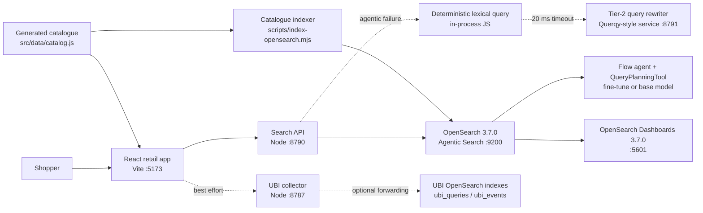
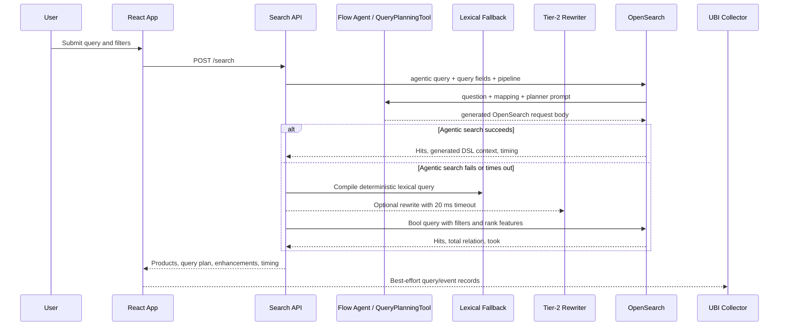

# Architecture Report: Second-Hand Retail Search

## Executive Summary

This prototype implements a search experience for a second-hand luxury marketplace where every sellable object is an individual listing. The system is designed around three constraints:

- High item cardinality: millions of unique listings, including repeated models sold by different sellers in different conditions.
- High relevance sensitivity: small wording differences matter for watches, jewelry, dresses, bags, and other luxury categories.
- Low latency: the target customer-facing search path is 200 ms end to end, including query understanding and any lightweight reranking.

The current implementation uses React for the retail experience, a Node search API as the critical-path service, OpenSearch 3.7.0 with native Agentic Search as the primary query-planning and retrieval engine, a deterministic lexical OpenSearch fallback, a local Querqy-style rewrite service for that fallback, and UBI event capture for relevance feedback. A native flow agent uses `QueryPlanningTool` with the fine-tuned retail model when its served alias is available and the pinned base model otherwise.

## Goals

- Return relevant, faceted product results for a catalogue of 2 million unique second-hand listings.
- Preserve search availability when relevance enhancement systems are unavailable.
- Capture query and interaction telemetry for relevance debugging and future Search Relevance Workbench workflows.
- Support phrase-level query understanding for ambiguous luxury terms, such as `dress watch`, where token-level interpretation is incorrect.
- Keep the prototype runnable locally with Docker, OpenSearch Dashboards, and simple Node services.

## Current Component Architecture

## Tier Model

| Tier | Component | Customer journey impact | Current behavior |
| --- | --- | --- | --- |
| Tier 1 | React app | Blocking | If unavailable, shoppers cannot search or browse. |
| Tier 1 | Search API | Blocking for full search | If unavailable, the browser falls back to a bounded local preview catalogue. |
| Tier 1 | OpenSearch catalogue index | Blocking for full search | Search API falls back to local preview data, but this is a degraded prototype path only. |
| Tier 1 | Native Agentic Search flow agent | Blocking for the primary natural-language path | OpenSearch plans the DSL with `QueryPlanningTool`; the Search API retries with deterministic lexical DSL on failure or timeout. |
| Tier 1 | In-process query understanding | Fail-open retrieval path | Compiles the lexical OpenSearch retry and powers browser fallback. |
| Tier 2 | Query rewriter / Querqy-style service | Non-blocking | Search API calls it with a tight timeout and continues when it is slow, down, or has no rule. |
| Tier 2 | UBI collector | Non-blocking | Frontend posts best-effort telemetry and catches failures. |
| Tier 2 | UBI OpenSearch indexes | Non-blocking | Improve observability and relevance tuning but do not block search. |
| Tier 2 | OpenSearch Dashboards | Non-blocking | Operational and relevance analysis surface only. |

This split is important. Query understanding that prevents category mistakes, such as distinguishing `formal watch` from a clothing query, belongs in Tier 1. Rewrites, boosts, curated synonyms, analytics, dashboards, and offline relevance diagnostics belong in Tier 2.

## Request Flow

## Data Architecture

The catalogue is generated deterministically from luxury item templates. This lets the prototype simulate marketplace scale while keeping the dataset reproducible.

Current catalogue behavior:

- `DEMO_CATALOG_SIZE`: 138 generated listings, covering all 69 product templates twice.
- `TARGET_CATALOG_SIZE`: defaults to the demo size for local OpenSearch indexing.
- `PREVIEW_CATALOG_SIZE`: uses the same balanced demo dataset for the browser/local fallback.
- `SCALE_CATALOG_SIZE`: 2,000,000 listings for explicit scale tests.
- Duplicate-looking items are intentional: each listing has its own seller, condition, price, country, size, score, and listing date.
- Item IDs use stable listing IDs such as `MR-0000001`.
- Important fields include `brand`, `title`, `category`, `material`, `condition`, `price`, `seller_tier`, `seller_score`, `quality_score`, `freshness_score`, `canonical_text`, and `vector_text`.

OpenSearch index:

- Alias: `secondhand_items_current`.
- Default backing index: `secondhand_items_v1`.
- Shards: 1 by default for local development.
- Replicas: 0 by default for local development.
- Refresh interval is disabled during bulk indexing and restored to `1s` after indexing.
- `brand` and `title` are both full-text fields with keyword subfields.
- Facet fields such as `category`, `condition`, `material`, `country`, and `seller_tier` use keyword mappings with lowercase/asciifolding normalization.
- `quality_score`, `freshness_score`, and `seller_score` use `rank_feature` fields for lightweight scoring.
- `vector_text` exists as a future embedding source field, but dense vector search is not implemented yet.

## Query Understanding

The primary path sends an OpenSearch `agentic` query through `secondhand-agentic-search`. Its flow agent uses the native `QueryPlanningTool`, the index mapping, an explicit query-field allowlist, and the exact system/user prompt assets used during fine-tuning. Deterministic understanding first merges safe category/material inference and the parsed price ceiling with explicit UI facets, and derives newest/lowest-price/price-drop intent when the UI remains on Recommended. The browser supplies only an active `personaId`; the API resolves the authoritative allowlisted profile and excludes names, demographics, and images. The service then includes the filters, exact result size, total-hit cap, sort mode, canonical `base_text_query`, deterministic `text_operator`, and bounded shopping-relevant persona context in a compact immutable contract inside the planner input. The pipeline's `agentic_context` response processor returns the generated DSL for validation, UBI, and debugging.

The v3 planner keeps the complete base query as the only required text clause. Profiled personas add exactly one optional `multi_match` scoring clause with a fixed `0.35` boost before the recommended quality/freshness/seller features; Anonymous adds nothing. Explicit sort modes keep the persona signal only as a score tie-break. Runtime validation rejects a changed expansion, boost, placement, hard constraint, base query, or ranking recipe, and both lexical and local fallbacks apply the same optional persona signal.

An end-to-end capture against OpenSearch 3.7 verified the native training input shape: the tool supplies the mapping source with its `_doc` wrapper and serializes both mapping and query fields as JSON string literals before prompt substitution. The offline objective reproduces that representation rather than training on a cleaner but serving-inaccurate prompt.

`AgenticQueryTranslator` replaces the incoming search body with the planner output while preserving the service-owned `_source` and `ext`. The planner therefore owns the complete executable body—`size`, `track_total_hits`, `query`, and any requested `sort`. If QueryPlanningTool silently uses its registered sentinel fallback, or the returned DSL misses a required constraint, the Search API discards that result and retries with deterministic lexical DSL.

That response validation happens after the generated query executes. It protects result correctness and drives fallback, but it cannot prevent an untrusted planner from consuming cluster resources. A production deployment must treat the model and connector as trusted execution inputs and add OpenSearch-side permissions, query limits, timeouts, and resource isolation; an application response validator is not a query sandbox.

Deterministic query understanding in `src/lib/search.js` is reused by both the browser fallback and the Search API's lexical OpenSearch retry.

It extracts:

- Brand intent from known catalogue brands.
- Category intent from category-specific term dictionaries.
- Material intent from material dictionaries.
- Price ceiling from phrases such as `under 5000` or `< 5k`.
- Phrase intents for ambiguous luxury concepts.
- Residual tokens for required lexical matching.

The phrase-intent layer handles cases where token-level matching is misleading. For example:

| Query | Correct interpretation | Why phrase handling matters |
| --- | --- | --- |
| `dress watch` | Watch for formal wear | Should not search the Dresses category. |
| `formal watch` | Dress watch | `formal` may not exist in listing text, so it must not become a required token. |
| `suit watch` | Dress watch | A watch style, not clothing. |
| `silk dress` | Dresses + Silk | Normal category/material interpretation should still work. |

On the fail-open path, the Search API turns this deterministic query plan into OpenSearch filters, must clauses, should boosts, and rank features.

## Ranking And Retrieval

The primary retrieval path is native Agentic Search. It passes the shopper request, required runtime constraints, desired sort, and mapped query fields to OpenSearch, which translates the `agentic` clause into DSL and executes it. The configuration script uses a flow agent because this catalogue has a known index and does not need conversation memory or multi-tool orchestration.

The deterministic lexical retry remains intentionally lightweight:

1. Apply hard filters:
   - `availability = active`
   - price ceiling
   - selected facets
   - Tier-1 inferred category/material filters where no explicit user facet overrides them
   - optional Tier-2 rewrite filters
2. Apply required text matching:
   - brand match when brand intent is detected
   - residual tokens with `operator: and`
3. Apply scoring boosts:
   - one bounded persona expansion for a profiled shopper
   - quality, freshness, and seller rank features
   - brand/title phrase matches
   - broad multi-field lexical query match
   - Tier-1 phrase-intent boosts
   - optional Tier-2 synonym, boost, and burial rules
4. Return source fields for UI rendering.

The API caps `track_total_hits` at 10,000 by default. Broad queries therefore display lower-bound counts such as `10,000+`, which protects latency. Exact counts are treated as a Tier-2 analytics concern.

## Tier-2 Query Rewriting

The prototype includes a local Querqy-style service rather than a real Querqy deployment. It is useful because it establishes the service contract:

- Input: raw query and Tier-1 query plan.
- Output: status, rewritten query, matching rule IDs, synonyms, filters, boosts, and burials.
- Failure modes: `applied`, `no_match`, `timeout`, `skipped`, or `disabled`.
- Timeout: 20 ms by default from the Search API.

Current rules live in `config/querqy-tier2-rules.json`. Example rules include:

- `dress-watch`
- `aurelle-cadre-watch`
- `bellune-bag`
- `silk-dress`
- `ardenne-berenice`
- `montreval-celestine`
- `leather-boots`

Production recommendation: replace the local service with standalone Querqy/Querqy Unplugged behind the same API boundary. Keep the Search API fail-open behavior.

## UBI And Relevance Feedback

The frontend captures two classes of UBI-style records:

- Query records: user query, rewritten query, query plan, filters, sort, result IDs, source, timing, and Tier-2 status.
- Event records: saves, unsaves, filter changes, product clicks, object metadata, and result position.

The collector writes local NDJSON files:

- `data/ubi-queries.ndjson`
- `data/ubi-events.ndjson`

When `UBI_FORWARD_OPENSEARCH=1`, it also writes to OpenSearch indexes:

- `ubi_queries`
- `ubi_events`

This makes relevance issues inspectable. A problematic query such as `formal watch` can be traced from query understanding to result IDs, click/save behavior, and eventual rule or model changes.

## Latency Design

Target: 200 ms end to end.

Current latency strategy:

- Run local native agentic planning with a 15-second request timeout while its quality and latency are evaluated.
- Retry against OpenSearch with in-process deterministic query understanding when agentic planning fails.
- Keep Tier-2 rewriting behind a strict 20 ms timeout.
- Use OpenSearch filters and rank features rather than heavy online computation.
- Cap total hit counting at 10,000.
- Return only needed `_source` fields.
- Avoid exact count jobs and offline analytics in the serving path.

Earlier sub-200 ms observations covered the deterministic lexical path only. The model-backed native Agentic Search path has not yet been measured with a live model endpoint and should not be assumed to meet the original 200 ms target.

Production latency budget should be explicit:

| Stage | Suggested budget |
| --- | ---: |
| Frontend request overhead | 10-25 ms |
| Search API request shaping | 5-15 ms |
| Native model-backed agentic planning | Measure separately; 15 s local timeout in the prototype |
| Tier-2 rewrite call | 0-20 ms hard cap |
| OpenSearch retrieval | 60-120 ms |
| Lightweight reranking / result shaping | 10-25 ms |
| Network and serialization buffer | 20-40 ms |

Any expensive embedding inference, analytics joins, full reranking, or exact counting should be async, cached, precomputed, or moved out of the customer-blocking path.

## Deployment Topology

Local development:

- React/Vite app: `http://127.0.0.1:5173`
- Search API: `http://127.0.0.1:8790`
- Query rewriter: `http://127.0.0.1:8791`
- UBI collector: `http://127.0.0.1:8787`
- OpenSearch: `http://127.0.0.1:9200`
- OpenSearch Dashboards: `http://127.0.0.1:5601`

Docker currently runs OpenSearch and Dashboards only. Node services run directly via npm scripts.

Production direction:

- Run React as a static app or edge-served frontend.
- Run the Search API as a horizontally scalable stateless service.
- Run OpenSearch as a managed or clustered service with multiple shards/replicas and index lifecycle procedures.
- Optionally run the pinned text-only Ministral planner on a SageMaker `ml.g5.2xlarge` real-time endpoint. OpenSearch invokes it through a least-privilege SigV4 connector; the deterministic lexical query remains the runtime fail-open path.
- Run Querqy/rewriter as a separate Tier-2 service with short timeouts and circuit breakers.
- Run UBI ingestion as a separate async pipeline with buffering.
- Keep Dashboards and Search Relevance Workbench off the serving path.

## Resilience And Failure Modes

| Failure | Current behavior | Production expectation |
| --- | --- | --- |
| Agentic pipeline/model unavailable | Search API retries with deterministic lexical OpenSearch DSL and records the fallback. | Same behavior, plus circuit breaker, cache, and separate model/pipeline SLOs. |
| Query rewriter down | Search API marks rewrite as `skipped` and searches normally. | Same behavior, plus circuit breaker and metrics. |
| Query rewriter slow | Search API times out and searches normally. | Same behavior with strict SLO monitoring. |
| UBI collector down | Frontend catches errors and continues. | Same behavior, with local/session buffering if useful. |
| OpenSearch down | Search API returns local preview fallback. | Production should use HA OpenSearch; local preview is prototype-only. |
| Search API down | Frontend falls back to local preview. | Production should use redundant API instances; browser fallback is not sufficient. |
| Dashboards down | No customer impact. | Same. |

## Current Limitations

- The rewriter is a Querqy-style mock, not a real Querqy Unplugged deployment.
- The system does not yet use dense vectors, multimodal embeddings, or hybrid retrieval.
- The catalogue generator simulates scale but is not a real ingestion pipeline.
- There is no production authentication, rate limiting, authorization, or PII strategy.
- OpenSearch runs with security disabled in local Docker.
- There is no formal load test suite yet.
- There is no offline relevance evaluation harness yet.
- Reranking is limited to OpenSearch scoring and rank features.
- Model-backed agentic planning can exceed the original 200 ms goal; production rollout needs caching, a faster planner, or a separate latency budget.

## Recommended Next Steps

1. Replace the local rewrite stub with standalone Querqy behind the existing `QUERY_REWRITE_ENDPOINT` contract.
2. Add a relevance evaluation set from UBI records, including ambiguous luxury queries and expected categories.
3. Add hybrid retrieval:
   - lexical OpenSearch query for precision and filters
   - retail-domain embedding retrieval for semantic nuance
   - lightweight final reranking for the top candidate set
4. Evaluate retail embedding models specifically on luxury resale concepts:
   - fine watches
   - jewelry
   - dresses and occasionwear
   - bag model names
   - material, condition, and style descriptors
5. Add latency instrumentation at every stage of `/search`.
6. Add load tests for the 2 million item index and realistic traffic mixes.
7. Add index versioning and blue/green alias swaps for catalogue refreshes.
8. Add dashboards for zero-result queries, rewrite hits, slow queries, and high-conversion queries.
9. Define production SLOs separately for Tier 1 and Tier 2.

## Key Files

| Area | File |
| --- | --- |
| React app | `src/App.jsx` |
| Query understanding and local fallback | `src/lib/search.js` |
| UBI frontend client | `src/lib/ubi.js` |
| Catalogue generator | `src/data/catalog.js` |
| Search API | `scripts/search-api.mjs` |
| Native Agentic Search setup | `scripts/configure-agentic-search.mjs` |
| OpenSearch indexer | `scripts/index-opensearch.mjs` |
| UBI index setup | `scripts/create-ubi-indexes.mjs` |
| UBI collector | `scripts/ubi-collector.mjs` |
| Tier-2 rewriter | `scripts/tier2-rewriter.mjs` |
| Rewrite rules | `config/querqy-tier2-rules.json` |
| OpenSearch Docker stack | `compose.yml` |

## Architectural Position

The current system is a good prototype foundation because it makes the most important product tradeoff explicit: basic search correctness must live in Tier 1, while relevance tuning systems should improve results without being able to break the customer journey.

For a real second-hand retail marketplace, the next architectural leap is not simply adding more rules. The system needs a strong retail embedding model and an evaluation loop grounded in UBI. OpenSearch should remain the serving backbone for structured filtering, lexical precision, and operational maturity, while query rewriting, embeddings, and reranking become controlled relevance layers around it.
